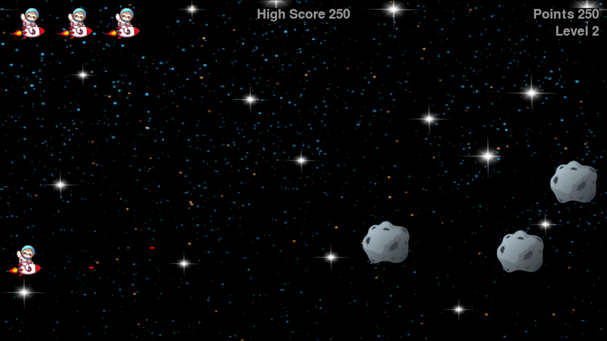
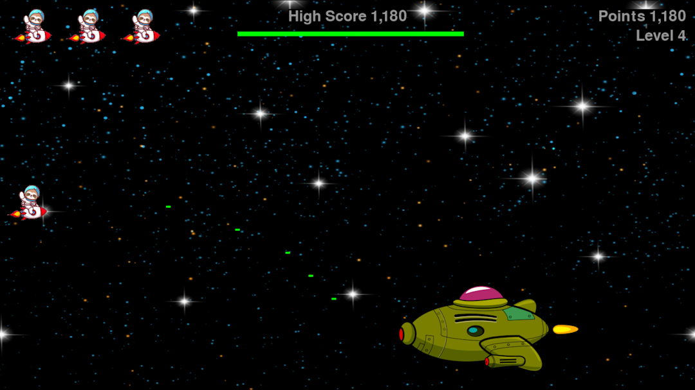

# Sloth In Space 🚀

Sloth In Space is an exciting game where you control a sloth in space, navigating through asteroid fields, shooting bullets, and facing off against a formidable boss ship.

## Table of Contents

- [Introduction](#introduction)
- [How to Play](#how-to-play)
- [Features](#features)
- [Controls](#controls)

## Introduction

Welcome to Sloth In Space, where you embark on a cosmic adventure with a sloth as your guide. Dodge asteroids, shoot your way through, and prepare for an epic battle against a powerful boss ship. Enjoy the immersive space environment and see how far you can go!

## Screenshots

## How to Play

Objective: Navigate through space, avoid asteroids, and defeat the boss ship to reach higher levels.
Click the "Play" button to start a new game.
Move the sloth ship up and down using the arrow keys.
Press the spacebar to shoot bullets and destroy asteroids.
Watch out for collisions with asteroids and enemy bullets.
Defeat the boss ship to advance to the next level.

## Features

scrolling background.
Dynamic asteroid generation.
Boss ship with health bar and random bullet patterns.
Score tracking and level progression.
Play button for starting a new game.

## Controls

⬆️ Up Arrow: Move sloth ship upward.
⬇️ Down Arrow: Move sloth ship downward.
🔵 Spacebar: Shoot bullets.
